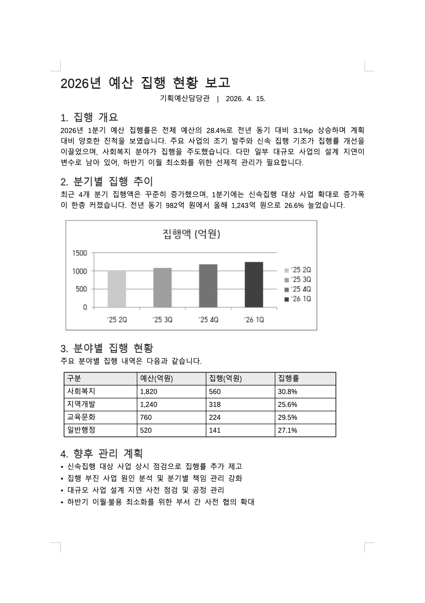
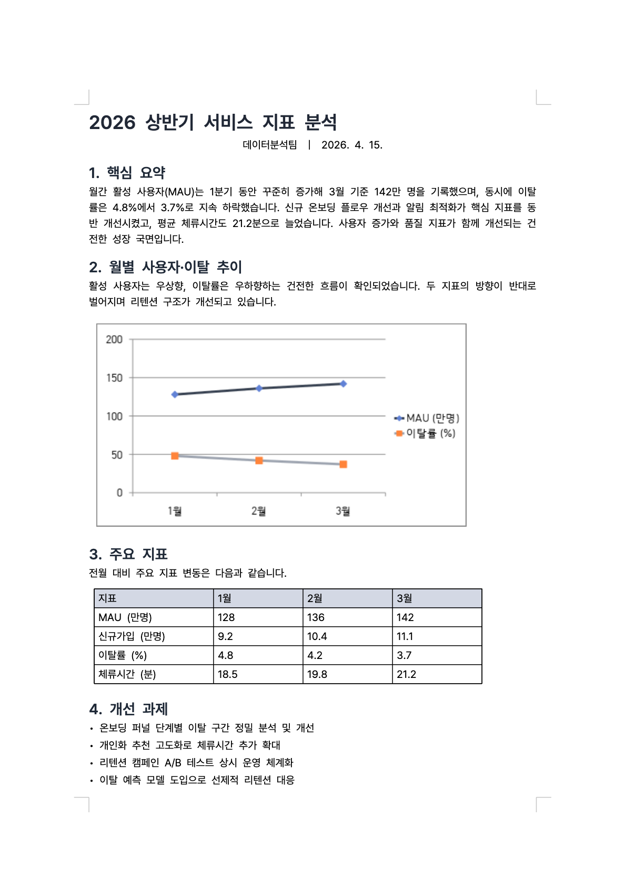
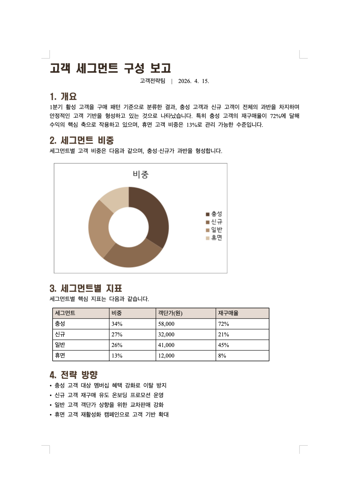
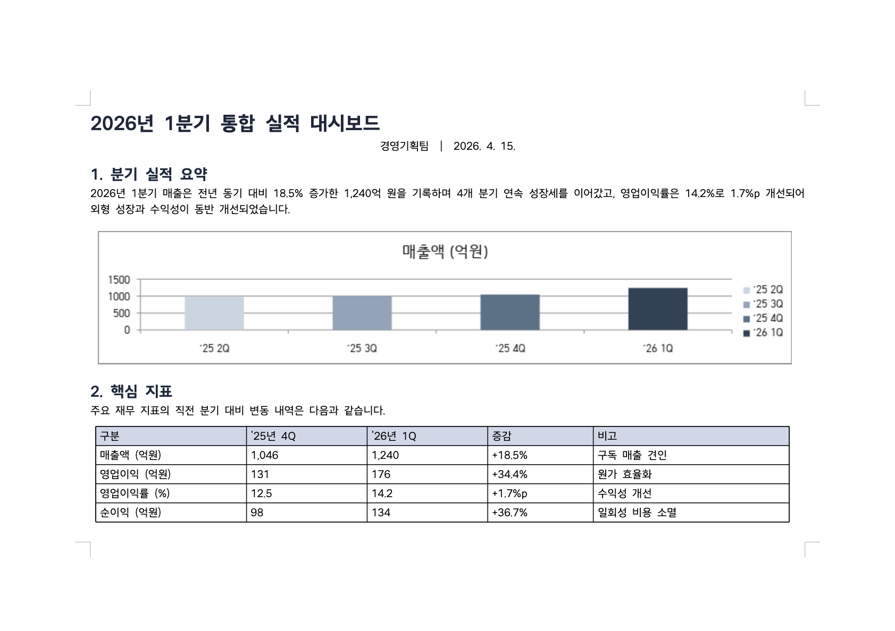
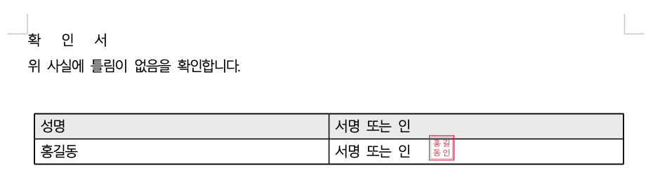
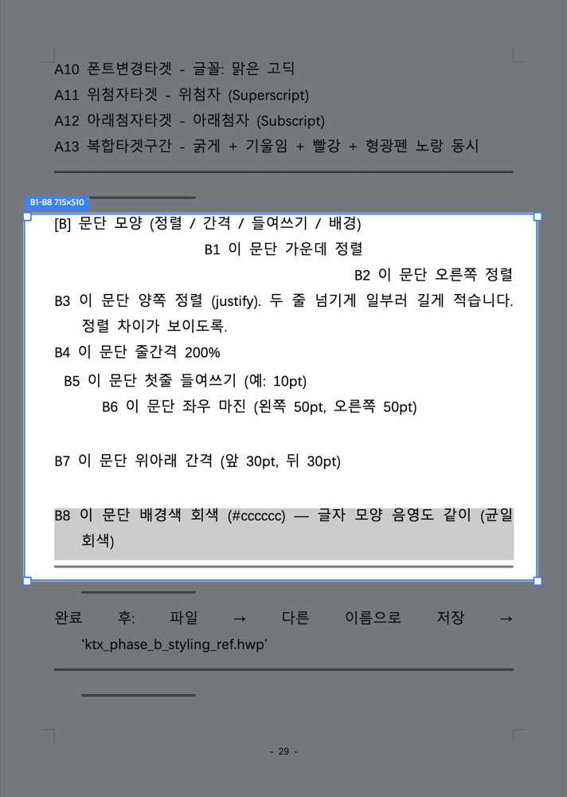
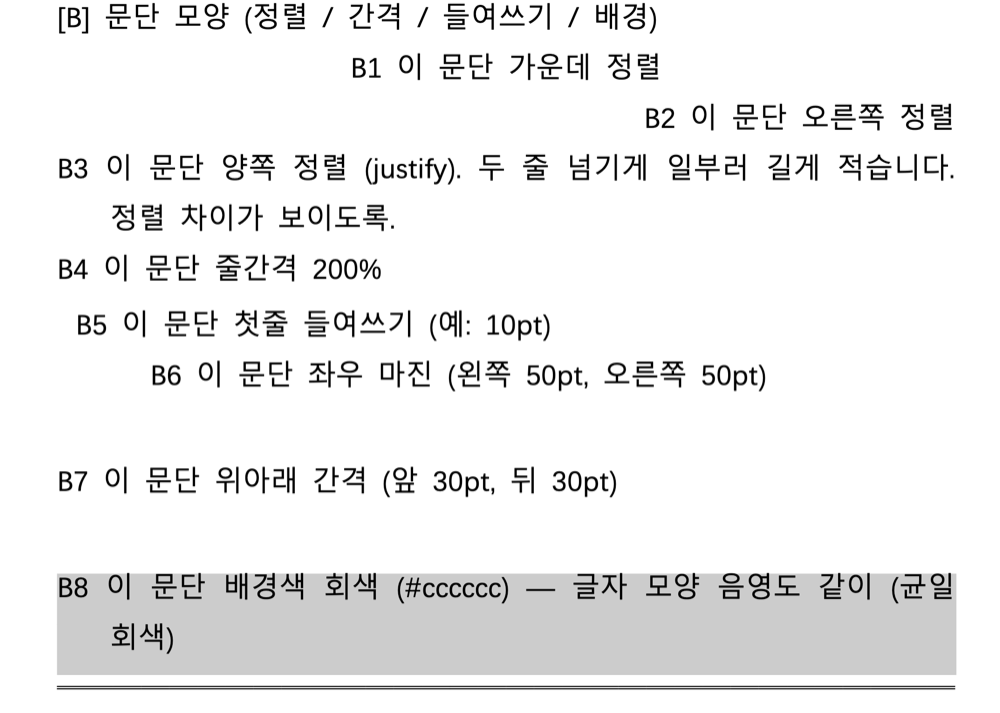

<h1 align="center">AIOFFICE-HWP</h1>

<p align="center">
  <sub>RECON Labs의 <a href="https://github.com/DoHyun468/claw-hwp">claw-hwp</a>를 포크하여 AIOFFICE 배포판으로 유지·발전시키는 프로젝트입니다. (MIT)</sub>
</p>

<p align="center">
  한글 문서(<b>.hwp · .hwpx</b>)를 <b>Claude · Codex로</b> 읽고 · 만들고 · 고치는 도구<br/>
  한컴오피스가 없어도, 코딩을 몰라도 됩니다.
</p>

<p align="center">
  
  <a href="LICENSE"></a>
</p>

<p align="center">
  <strong>한국어</strong> · <a href="README_EN.md">English</a>
</p>

---

## 이게 뭔가요?

회사에서 한글(.hwp) 문서, 많이 쓰시죠? 보고서·공문·계획서·표가 잔뜩 든 서식들요.

`AIOFFICE-HWP`를 설치하면 **Claude·Codex 같은 AI에게 한국어로 말하듯 시키기만 하면** 한글 문서를 직접 읽고, 새로 만들고, 고쳐 줍니다.

> - "이 보고서 표에서 매출 칸을 120억으로 바꿔줘"
> - "제목은 파란색 굵게, 본문은 맑은 고딕으로 해줘"
> - "이 문서 본문을 2단으로 나눠줘"
> - "표 하나 만들고 꼬리말에 쪽번호 넣어줘"

이렇게 말하면 됩니다. 결과 파일은 **한컴오피스나 한컴독스(한글 웹)에서 그대로 열립니다 — 안 깨져요.**

한컴오피스 · LibreOffice · 윈도우 전용 프로그램 — **아무것도 필요 없습니다.**

> 컴퓨터에 [Node.js](https://nodejs.org/) 18 이상만 있으면 됩니다 (Windows·macOS·Linux 모두 지원). 도장 이미지 생성 등 일부 보조 기능은 Python 3.9+를 사용해요 — 없어도 문서 읽기/만들기/편집은 전부 동작합니다.

## 누구를 위한 건가요?

- 한글(.hwp) 문서를 자주 다루는 **회사원 · 공무원 · 실무자**
- Claude Code / Codex 등 AI 에이전트를 쓰는 분
- **코딩을 몰라도 됩니다** — 한 번 설치하고, 말로 시키면 돼요.

---

## 뭐가 되나요?

한글 문서에서 자주 쓰는 기능을 기준으로, **지금 되는 것(✅)** 을 정리했어요.

### 📖 읽기
- ✅ 문서 내용 · 표 · 정보 읽어 오기
- ✅ 표 안 셀 내용까지 통째로 뽑아 보기

### ✍️ 글자 꾸미기
- ✅ 굵게 · 기울임 · 밑줄 · 취소선
- ✅ 형광펜 · 글자색
- ✅ 글자 크기 · 글꼴(폰트)
- ✅ 위 첨자 · 아래 첨자
- ✅ 자간(글자 사이 간격) · 장평(글자 폭)
- ⬜ 외곽선 · 그림자 · 강조점

### 📐 문단 꾸미기
- ✅ 정렬 (왼쪽 · 가운데 · 오른쪽 · 양쪽 · 배분 · 나눔)
- ✅ 줄 간격
- ✅ 들여쓰기 · 왼/오른쪽 여백 · 문단 위아래 간격
- ✅ 문단 배경색
- ✅ 글머리표 · 문단 번호 · 수준 올리기/내리기

### 📊 표
- ✅ 표 만들기
- ✅ 셀 내용 입력 · 바꾸기
- ✅ 셀 배경색 · 테두리 · 대각선
- ✅ 셀 합치기 · 나누기
- ✅ 줄/칸 추가 · 삭제
- ✅ 셀 너비·높이 같게 · 세로 정렬
- ✅ 표 머리행 색 · 셀 여백 · 표 크기 · 쪽 넘는 표 경계선

### 🧩 넣기
- ✅ 그림(이미지)
- ✅ 도형 (사각형 · 타원 · 선 · 호)
- ✅ **차트 — 20종** (막대 · 꺾은선 · 원 · 도넛 · 3D 등) + 행/열 데이터 직접 지정 + **문서 테마색 자동 적용**
- ✅ 글상자
- ✅ 수식
- ✅ 문자표(특수기호)
- ✅ 각주 · 미주
- ✅ 누름틀(입력 양식) · 하이퍼링크 · 책갈피
- ✅ 문단 띠
- ✅ **서명 · 날인** (도장 · 서명을 서명란에 얹기 — 줄에 맞춰 정확히, 표/페이지 안 키움)
- ✅ **개체 배치** (글 앞으로 · 어울림 · 자리차지 · 글 뒤) + 위치 · 크기 · 선 · 채우기 조절
- ✅ **개체 삭제** (그림 · 도형 · 차트 · 표 · 수식 지우기)
- ⬜ 메모 *(저장하면 사라지는 항목이라 제외)*

### 📄 쪽(페이지)
- ✅ 용지 크기 · **방향(가로/세로)** · 여백
- ✅ 머리말 · 꼬리말 (글자)
- ✅ 쪽 번호 (머리말·꼬리말 × 왼쪽/가운데/오른쪽)
- ✅ 다단 (2단 · 3단)
- ✅ 쪽 나누기 · 단 나누기
- ⬜ 쪽 테두리 · 배경

### 🆕 만들기 · 고치기
- ✅ 새 문서 만들기 (.hwp · .hwpx)
- ✅ 기존 문서를 **원본 형식 그대로** 고치기 — 형식을 바꾸지 않으니 **안 깨져요**
- ✅ **문서 테마** (색 · 글꼴 · 차트색 · 표 머리색을 한 번에) — 아래 [🎨 테마](#-테마--색글꼴차트표-머리색을-한-번에) 참고
- ✅ **개인정보 안전 서식 채우기** — 아래 [📝 서식 채우기](#-서식-채우기) 참고
- ✅ 미리보기
- ⬜ PDF · 워드(docx) 변환 *(다음 버전 예정)*

> 💡 **".hwp ↔ .hwpx 변환"은 사실 쓸 일이 거의 없어요.**
> .hwp는 .hwp로, .hwpx는 .hwpx로 — **받은 형식 그대로** 열고 고치고 저장하기 때문이에요. 형식을 굳이 바꾸는 변환 기능도 들어 있지만(표·글은 유지), 이미지 등 일부가 달라질 수 있어 **가급적 원본 형식 그대로** 쓰시길 권합니다.

> ✅ = 지금 바로 되는 기능 · ⬜ = 아직 안 되거나 다음 버전 예정이에요.

---

## 🎨 테마 — 색 · 글꼴 · 차트 · 표 머리색을 한 번에

"정부 공문 느낌으로", "모던하게", "따뜻한 톤으로" 한마디면 **제목 색·본문 글꼴은 물론 차트 색과 표 머리행 색까지** 한 가지 톤으로 통일해 줍니다. 아래는 **같은 보고서를 테마만 바꿔** 만든 예시예요 — 차트 종류(막대·꺾은선·원·도넛)와 가로/세로도 자유롭게.

<table>
  <tr>
    <td align="center"><br/><sub><b>정부</b> · 막대그래프</sub></td>
    <td align="center"><br/><sub><b>모던</b> · 꺾은선</sub></td>
  </tr>
  <tr>
    <td align="center"><br/><sub><b>따뜻함</b> · 도넛</sub></td>
    <td align="center"><br/><sub><b>심플</b> · 가로 방향</sub></td>
  </tr>
</table>

---

## ✍️ 서명 · 날인 — 서명란에 도장 · 서명을 정확히

서명란이나 "(서명 또는 인)" 칸이 있는 문서에, 가지고 있는 **도장 · 서명 이미지**를 줄에 맞춰 깔끔하게 얹어 줍니다. 표 칸이든 자유 줄이든 자동으로 위치를 잡고, **표나 페이지를 키우지 않아요.** 사각 도장이든 가로로 긴 서명이든 비율 그대로. 도장이 없으면 이름으로 **빨간 정사각형 날인**을 만들어 드립니다.

<table>
  <tr>
    <td align="center"><br/><sub>이름으로 만든 빨간 날인</sub></td>
    <td align="center"><br/><sub>서명란에 정확히 — 칸은 그대로</sub></td>
  </tr>
</table>

> 도장 · 서명 이미지도 개인정보로 다룹니다 — 화면에 띄우지 않고, 작업이 끝나면 정리합니다.

---

## 📝 서식 채우기

공문 · 신청서 · 계획서 · 이력서처럼 **자주 쓰는 표준 서식에 내 정보를 채워 넣는** 기능이에요. "이 신청서에 내 정보로 채워줘" 한마디면 성명·주소·연락처 같은 빈칸이 채워집니다.

### 🔒 개인정보는 안전하게
주민등록번호·사업자번호처럼 민감한 정보가 들어가죠. 그래서 이렇게 동작해요:
- **값을 채팅에 적지 않아요.** 내 정보는 내 컴퓨터 안 메모 파일에만 두고, **AI는 그 값을 들여다보지 않습니다** — 서식에 옮겨 적는 기능만 그 파일을 읽어요. (채팅에 주민번호를 붙여넣을 필요가 없어요.)
- 기본은 **쓰고 바로 지우기**(임시). 매번 적기 번거로우면 "저장해둬"라고 할 때만 내 컴퓨터에 보관하고, 원하면 언제든 지웁니다.
- 다 됐는지 확인할 때도 **값은 가린 채**(••••) 확인해요.

### 🔁 모양이 달라도 알아서 맞춰요
같은 정보라도 서식마다 칸 모양이 다르죠. 생년월일을 `970605`로 받는 곳, `97.06.05`로 받는 곳, 전화번호를 `010-1234-5678`·`01012345678`·`82)10-1234-5678`로 받는 곳 — **그 칸에 맞는 모양으로 알아서 바꿔** 넣어줍니다. 한 번만 적어두면 어느 서식이든 맞춰져요.

---

## 👀 결과를 눈으로 확인하기 — 한컴독스 캡처 *(선택)*

"고쳐 줬다는데, 진짜 한컴에서 잘 보이나?" — 이걸 **실제 화면 그대로 이미지로 확인**할 수 있는 도우미가 따로 있습니다: **`hancomdocs-capture`**.

- 동의하시면 처음 **딱 한 번** 브라우저 창이 떠서 한컴독스에 로그인합니다.
  *(비밀번호는 저장하지 않아요. 로그인 정보는 **내 컴퓨터에만** 남습니다 — 브라우저에 한 번 로그인해 두면 다음에 안 물어보는 것과 똑같아요. 그래서 한 번 해두면 다시 로그인 없이 계속 쓸 수 있어요.)*
- 그 다음부터는 문서를 자동으로 한컴독스에 올려서 **실제로 보이는 모습을 사진으로 찍어 옵니다.**
- 그 사진을 **사람도 보고, Claude도 직접 보고 확인**하기 때문에 — "말로만 됐다"가 아니라 **눈으로 검증된 결과**가 나옵니다. 그래서 **결과 품질이 확 올라갑니다.**

| 원하는 영역 고르기 | 확대해서 보기 |
|:---:|:---:|
|  |  |

> 없어도 기본 기능은 다 됩니다 — 이건 "눈으로 확인"을 더해 주는 선택 도우미예요. 설치는 바로 아래를 보세요.

---

## 📥 설치

> **Claude와 Codex 둘 다 됩니다** (둘 다 설치·동작 검증 완료). 같은 GitHub 저장소를 쓰고, 명령어만 각자 달라요. 본인 환경에 맞는 방법을 보세요.

### 일반 사용자 — Claude 데스크톱 앱 (Mac · Windows)

1. **Code** 탭에서 왼쪽 **Customize** 클릭
2. **개인 플러그인** 옆 **`+`** → **마켓플레이스 추가**
3. 아래 주소를 붙여넣고 **동기화(Sync)**:

   ```
   https://github.com/aidenlim-dev/AIOFFICE-HWP
   ```

**끝!** 이제 한글 파일을 채팅에 올리거나 파일 이름을 말하면 자동으로 작동합니다.

> 💡 **이렇게 말해 보세요:** `report.hwp 보여줘` · `이 한글 파일 열어줘` · `회의록.hwp 에 한 줄 추가해줘`
> (추상적인 "설치해줘 / 설정해줘" 보다, **파일이나 파일명을 같이** 말하면 잘 작동해요.)

### 👀 "눈으로 확인" 도우미도 같이 *(선택)*

위에서 소개한 한컴독스 캡처는 본체와 분리된 선택 애드온입니다. 설치 가능한 배포본이 연결된 환경에서는 해당 애드온을 추가로 설치하고, 처음 한 번 한컴독스 로그인만 하면 계속 쓸 수 있어요.

### 🧑‍💻 코딩하시는 분 — Claude Code (CLI)

```bash
claude plugin marketplace add https://github.com/aidenlim-dev/AIOFFICE-HWP
claude plugin install aioffice-hwp@aioffice-hwp-marketplace
```

> 업데이트한 뒤에는 **새 세션(새 창)** 을 여세요 — 열려 있던 세션은 옛 버전으로 계속 동작합니다.

### 🤖 Codex 앱 — 똑같이 됩니다 ✅ *(검증 완료)*

Codex에서도 **같은 저장소를 그대로** 씁니다. 마켓플레이스로 추가해 설치하면 `aioffice-hwp:hwp` 스킬이 자동으로 로드되고, **미리보기 뷰어도 Codex 인앱 브라우저에서 옆에 떠요** (Claude Code 앱처럼).

```bash
codex plugin marketplace add https://github.com/aidenlim-dev/AIOFFICE-HWP
codex plugin add aioffice-hwp@aioffice-hwp-marketplace
```

> Claude는 `claude plugin …`, Codex는 `codex plugin …` — **명령어만 다르고 같은 저장소로 똑같이 설치**됩니다. (검증: 마켓플레이스 추가 → 설치 → `aioffice-hwp:hwp` 로드 → localhost 미리보기까지 정상)

---

## 🐞 문제가 있거나 안 되는 게 있으면

- 곧 **GitHub 이슈 페이지**로 오류를 바로 보낼 수 있게 만들 예정입니다. *(준비 중)*
- 그때까지는 [Issues](https://github.com/aidenlim-dev/AIOFFICE-HWP/issues)에 **어떤 파일에서 무엇이 안 됐는지** 적어 주세요. 가능하면 그 한글 파일도 같이 올려 주시면 빠르게 고칠 수 있어요.

---

## 미리보기 — 고친 한글 문서를 바로 화면에서

여기서 **"미리보기"** 는 **고치거나 만든 한글(.hwp) 문서가 실제로 어떻게 생겼는지 화면에 그려서 보여주는 것**을 말해요. 읽기·만들기·고치기 자체는 어디서든 똑같이 되고, **이 한글 미리보기를 어디에 띄우는지만** 환경에 따라 다릅니다:

| 환경 | 한글 미리보기 |
|---|---|
| **Claude 앱(Code 모드) · Codex 앱** | 둘 다 같은 방식 — 앱 안에서 옆에 바로 표시 (localhost 미리보기) |
| **Claude Code (CLI · 터미널)** | localhost 미리보기를 클릭 링크로 → 외부 브라우저에서 |
| **Claude Cowork** | (원격이라 localhost를 못 띄워요) → github.io 뷰어에 파일 끌어 놓기 |

> 📄 **설치·로그인 없이 한글 파일을 그냥 열어 보기만** 하려면 누구나 — <https://aidenlim-dev.github.io/AIOFFICE-HWP/> 에 끌어 놓으면 브라우저에서 바로 보여요. (claude.ai 웹처럼 스킬이 안 깔리는 곳에서도 이 뷰어는 됩니다.)
> 🔍 **한컴과 100% 똑같이** 검토·편집하려면 — **한컴오피스(한글) 앱이나 한컴독스**에서 여세요. 이 한글 미리보기는 "작업 중 빠른 확인"용이고, 한컴 호환성 **검증**은 위 [한컴독스 캡처](#-결과를-눈으로-확인하기--한컴독스-캡처-선택)가 맡아요.

---

## 만든 기반

[rhwp](https://github.com/edwardkim/rhwp)(오픈소스 한글 형식 코어)로 문서를 읽고, 그 위에 **기존 파일을 원본 그대로 고치는 기능**과 **한컴오피스/한컴독스에서 안 깨지게 저장하는 기능**을 직접 더했습니다.

## 라이선스

MIT
